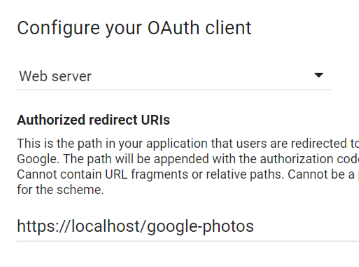

# Google Photos for Obsidian

  

<a href="https://ko-fi.com/alan_" target="_blank"></a>

This plugin let's you embed Google Photos images directly into Obsidian. When you select an image, it will save and embed a low-res thumbnail with a link back to the full-res image on Google Photos.


If your note title has a detectable date, you can have the plugin default to showing you only photos from that date. There is a toggle at the top to show all photos instead.

## Using a mobile device

You can use Google Photos on a mobile device, but due to mobile limitations you will first need to connect to Google Photos from Obsidian using a desktop device.

Once your desktop is authenticated, you can sync the plugin settings to your mobile device and it will work without any issues. If you're using any sort of sync of your Obsidian vault, this should happen automatically. Specifically you need to transfer the `data.json` file from the desktop plugin folder to your mobile device.

If you're using Obsidian Sync, you'll need to make sure the **Installed community plugins** sync option is enabled on both your desktop and mobile device for the settings to be transferred correctly.

# How to set up

To connect to Google Photos from a third-party plugin, you will need to create an API key for the plugin to use.

**The plugin will only request read-only access. It is not able to modify your photos or albums.**

1. Visit [https://developers.google.com/photos/library/guides/get-started](https://developers.google.com/photos/library/guides/get-started)


2. Click the button that looks like this:


3. Create a new project and give it any name you like. 
Use the same name on the next screen which asks for the "product name":


4. Fill in these settings for the OAuth configuration screen:

Redirect URI: `https://localhost/google-photos`



5. Click **Create**.


6. Copy the `Client ID` and `Client Secret`. You will need to add these values into the Obsidian plugin settings:


# Advanced features

There is very basic codeblock support. You can run your own custom queries using the Photos API search format:

https://developers.google.com/photos/library/reference/rest/v1/mediaItems/search

For example, if you wanted to show photos of food taken on every April 1st, you would use:

````
```photos
{
  "filters": {
    "dateFilter": {
      "dates": [{
        "year": 0,
        "month": 4,
        "day": 1
      }]
    },
    "contentFilter": {
      "includedContentCategories": [
        "FOOD"
      ]
    }
  }
}
```
````

# Adjusting the visual style

If you want to adjust the styles, these are the classes used:

`.google-photos-grid-thumbnail` - the thumbnail images
`.google-photos-codeblock` - the embedded codeblock container
`.google-photos-modal-grid` - the popup modal grid container

# FAQs

#### Do the images have to be saved locally? Can they be remote thumbnails?

The way that Photos API generates the URLs, the direct image links are only available for a short time and then they expire. So while you could add them to your notes, they would stop working at some point.

I'm testing a few potential options at the moment, but it takes time to wait out the link expiry (or non-expiry, if it works).

---

### Attribution

Loading spinner from [loading.io](https://loading.io/)
