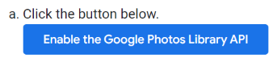
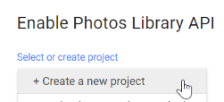
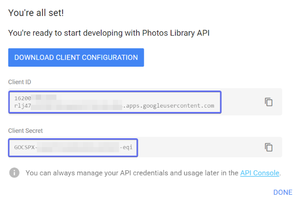

# Setup instructions

To connect to Google Photos from a third-party plugin, you will need to create an API key for the plugin to use.

**The plugin will only request read-only access. It is not able to modify your photos or albums.**

1. Visit [https://developers.google.com/photos/library/guides/get-started](https://developers.google.com/photos/library/guides/get-started)

2. Click the button that looks like this:

3. Create a new project and give it any name you like. 
Use the same name on the next screen which asks for the "product name":

4. Fill in this Redirect URI for the OAuth configuration screen:

Redirect URI: `https://alangrainger.github.io/obsidian-google-auth-proxy/?handler=google-photos`

> ### What is this?
> 
> Google OAuth cannot use an `obsidian://` URL as a redirect URI, so we use a proxy running on Github Pages to transparently pass a Google OAuth request back to Obsidian. The incoming data in itself is useless without the `client_id` and `client_secret` which only exist inside your vault. Because it is on Github Pages, you can check the source yourself to see that it has the single function of transparently passing data back to Obsidian: https://github.com/alangrainger/obsidian-google-auth-proxy

5. Click **Create**.

6. Copy the `Client ID` and `Client Secret`. You will need to add these values into the Obsidian plugin settings:

