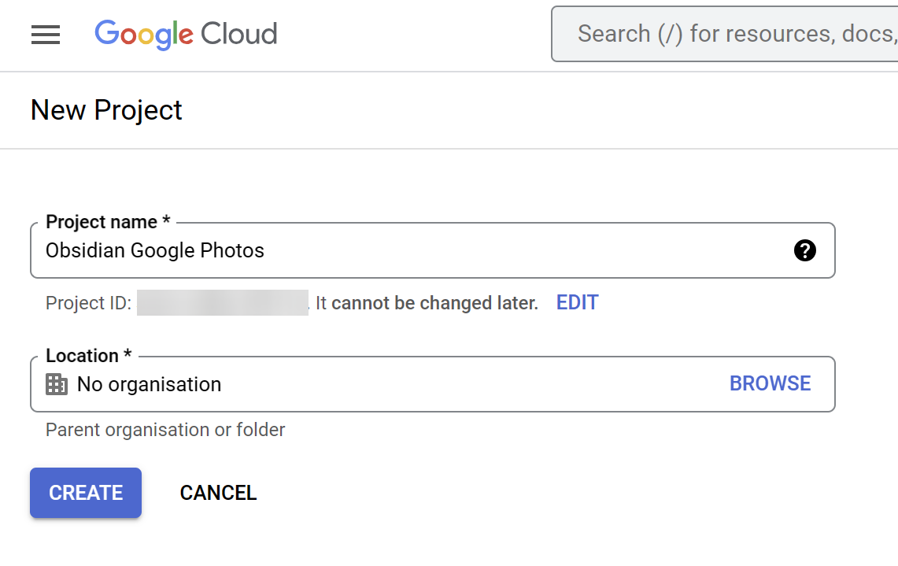
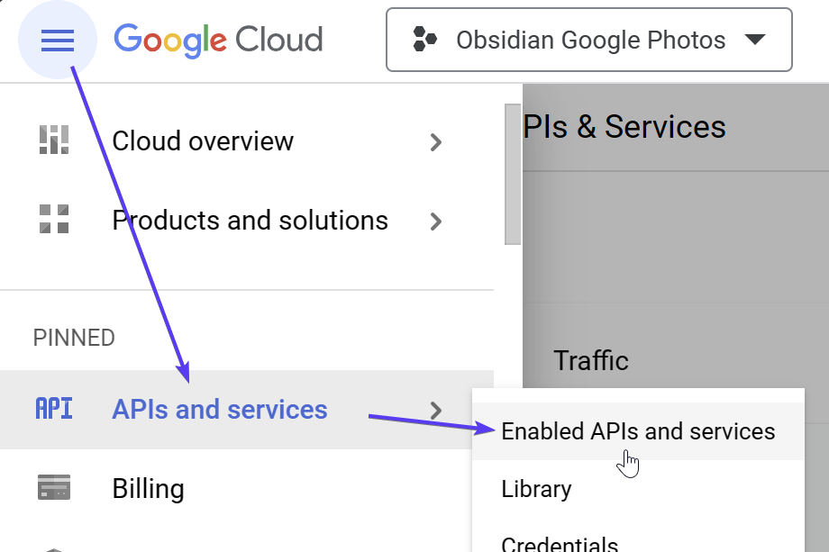
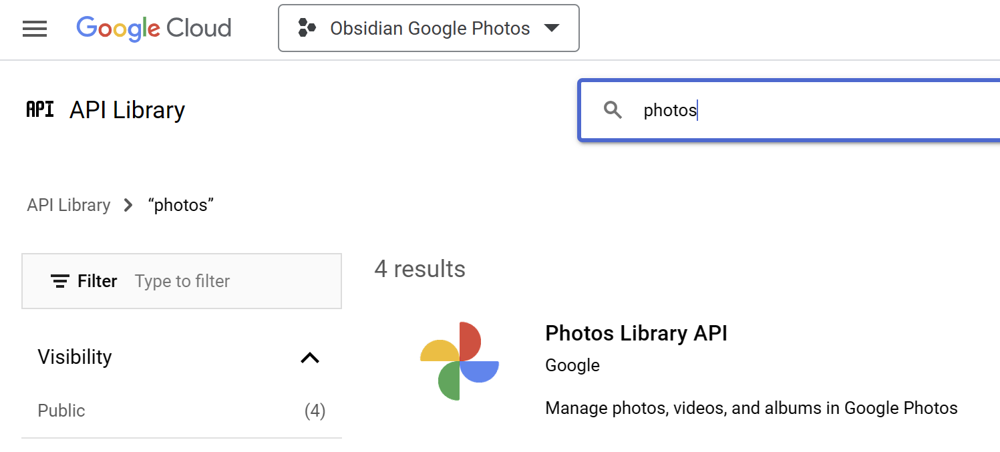
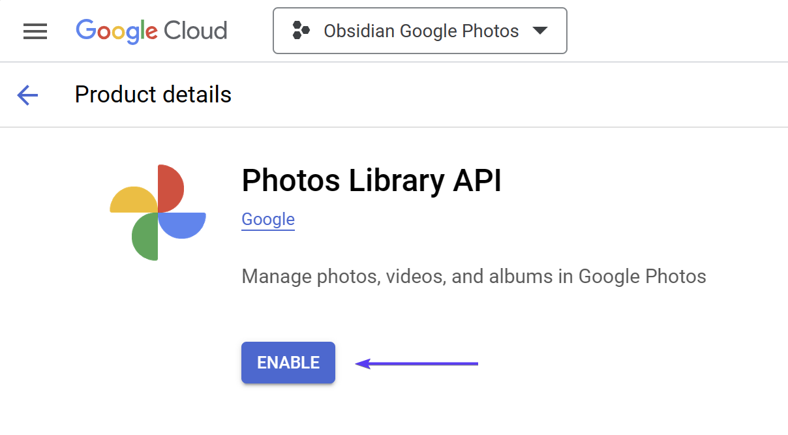
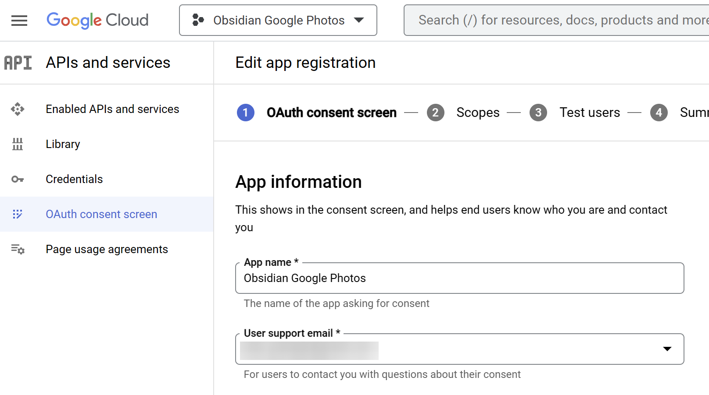
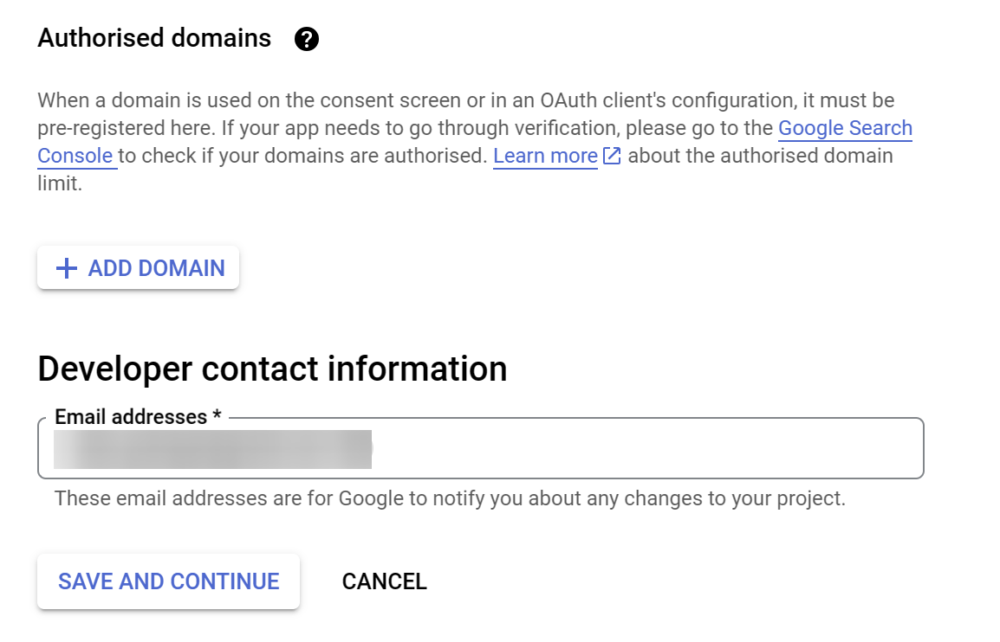
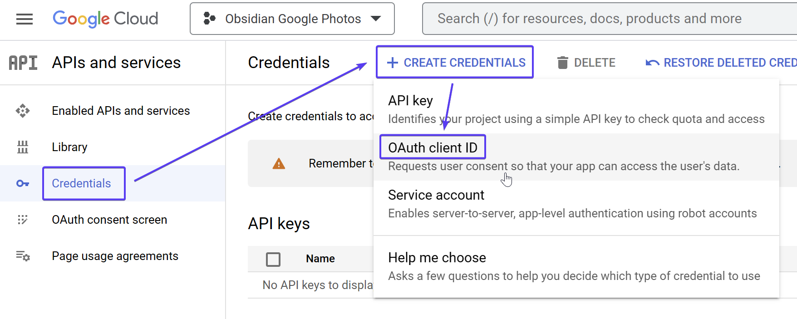
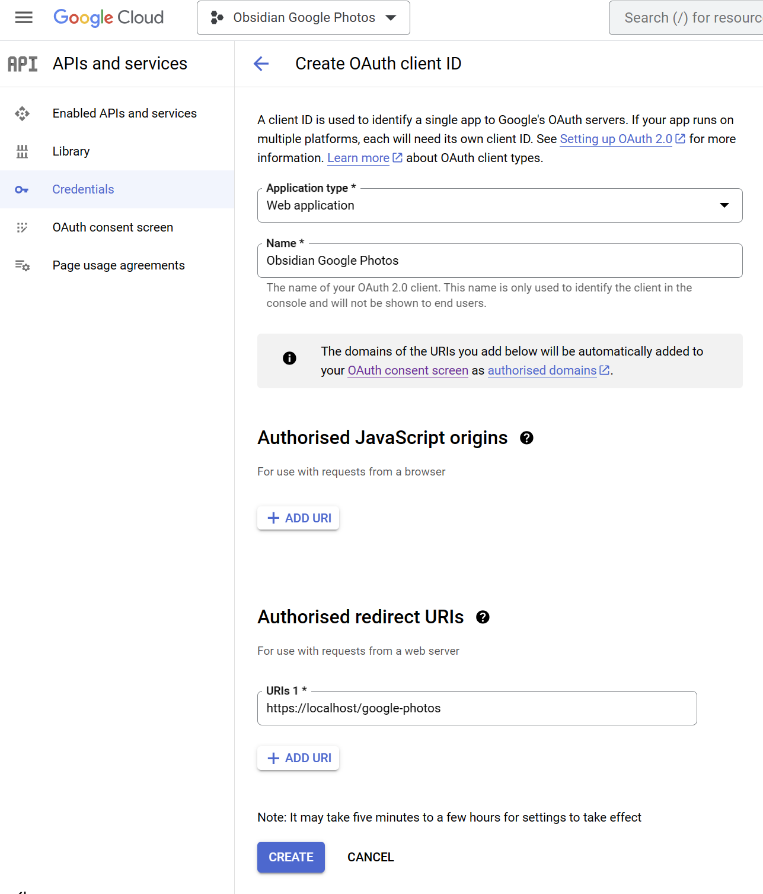
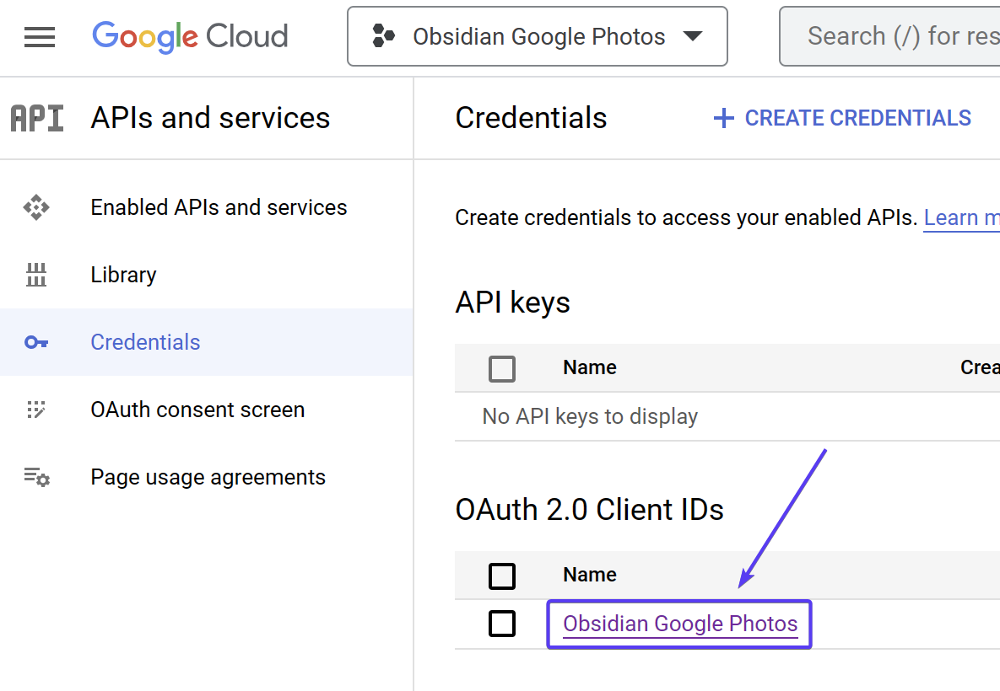
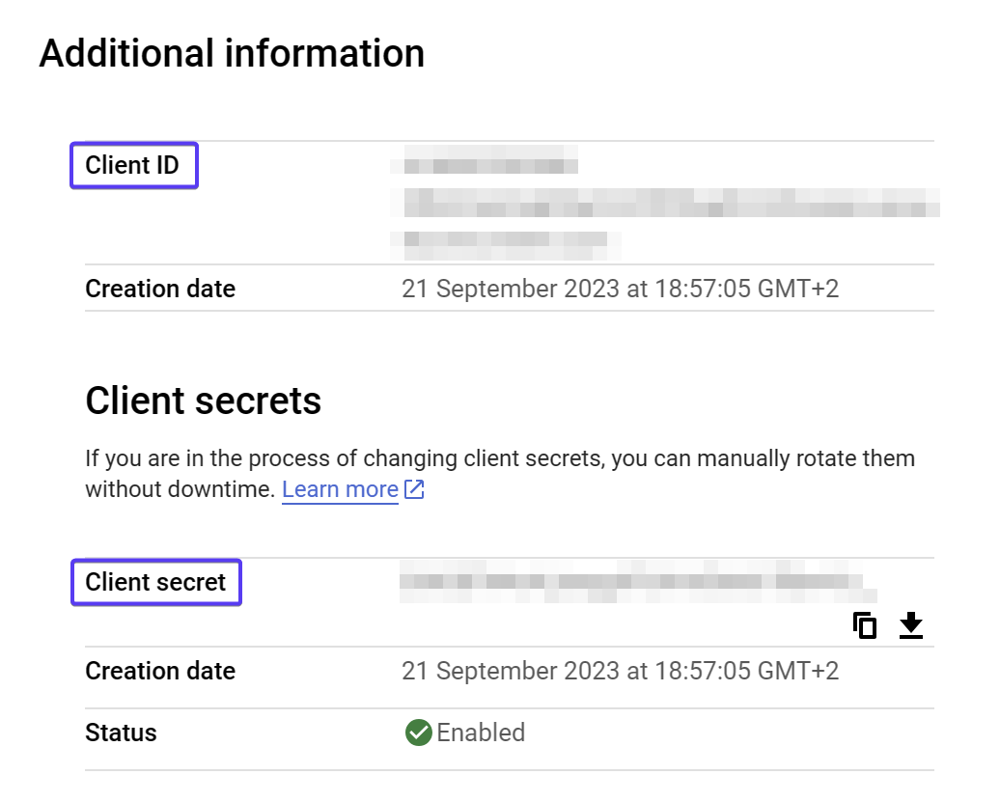

# Setup instructions

To connect to Google Photos from a third-party plugin, you will need to create an API key for the plugin to use.

**The plugin will only request read-only access. It is not able to modify your photos or albums.**

1. Visit [https://console.cloud.google.com/projectcreate](https://console.cloud.google.com/projectcreate)

2. Create a new project and give it any name you like. "Obsidian Google Photos" is a good choice.

3. Click Create. Once the new project has been created, ensure that it is selected in the top menubar:

4. Click on the hamburger menu, then **APIs and servers**, then **Enabled APIs and services**:

5. Search for "photos", then choose the Photos API, and then **Enable**:

6. Click on **OAuth consent screen**, choose **External** and click **Create**:

7. Fill in these fields:

- **App name**: Any name, "Obsidian Google Photos" is a good idea.
- **User support email:** Your own Gmail address.
- **Developer contact information:** Your own Gmail address.

And click **Save and continue**.

8. On the **Scopes** page, just click **Save and continue**.

9. On the **Test users** page, add yourself as a test user and click **Save and continue**.

10. Click on **Credentials** > **Create credentials** > **OAuth client ID**:

11. Fill in these fields:

- **Application type:** Web application
- **Name:** Any name, "Obsidian Google Photos"
- **Authorised redirect URIs:** `http://localhost:51894/google-photos`

And click **Create**.

12. Click back into the client ID

13. Copy the client ID and secret. These are the two values you need to put into the plugin settings.

14. Painful? Yes. I absolutely agree. But that's it, you're done!

## Troubleshooting

If you experience issues connecting after setup, please have a look at some common solutions here:

[Authentication troubleshooting](Authentication%20troubleshooting.md)
